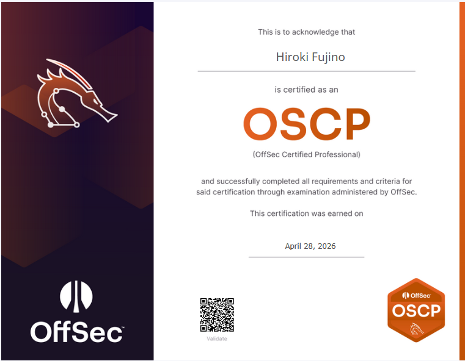

I took the OSCP+ exam from April 25 to 26, 2026, and officially passed it.

## Journey

I bought a [Learn One membership](https://www.offsec.com/products/learn-one/) in August 2025. It includes 1 year lab access and 2 exam attempts.

## Preparation

**August - October:** Completed the Syllabus except for the out of scope of the exam.

**October - November:** Completed 10 out of 11 challenges labs. I skipped Skylark lab because it was too huge.

**December:** Completed about 30 practice machines in [NetSecFocus Trophy Room](https://docs.google.com/spreadsheets/u/1/d/1dwSMIAPIam0PuRBkCiDI88pU3yzrqqHkDtBngUHNCw8/htmlview).

When I was stuck on challenge labs or practice machines, I visited the OffSec Discord server for hints.

## The exam

### First attempt (2025/12/20)

The first attempt in December 2025 failed. I scored 30 points: both flags from one independent machine and only the local.txt from a second.

|Machine|Points|
|:---|:---|
|Independent 1|20|
|Independent 2|10|
|Independent 3|0|
|AD set|0|

During the exam, I slept only for a couple of hours and spent a lot of time trying to compromise the AD set, but couldn't find the way.

### Retrospective after the first attempt

After the exam failure, I mainly focused on the following things:

**1. Lack of Windows privilege escalation skills**

I felt underprepared for Windows machines, so I worked through the Windows machines in HTB using [this list](https://0xdf.gitlab.io/cheatsheets/offsec).

**2. Organize notes and build a mindmap**

My notes had enough information for the exam, but they were messy. I reorganized them to make the information easier to find and created a mindmap.

**3. Try hard, but know when to take a break**

During the first attempt, I panicked when I couldn't find a way into the machines and hesitated to step away. After reading some blogs, I realized it is important to take a break when stuck on a problem for more than an hour.

### Second attempt (2026/04/25)

#### Timeline

I reached the passing score (70 pt) after 6 hours.

|Date|Time|Event|Points|
|:---|:---|:---|:---|
|4/25|14:00|Started the exam|0|
|4/25|16:08|proof.txt of the first machine of the AD Set|10|
|4/25|17:18|proof.txt of the second machine of the AD Set|20|
|4/25|17:38|proof.txt of the domain controller of the AD Set|40|
|4/25|18:16|local.txt of Independent Machine 1|50|
|4/25|18:35|proof.txt of Independent Machine 1|60|
|4/25|19:00-20:00|Dinner break|60|
|4/25|20:15|local.txt of Independent Machine 2|70|
|4/25|21:00|proof.txt of Independent Machine 2|80|
|4/25|21:00-22:00|Break|80|
|4/25|22:00-0:00|Tried Independent Machine 3|80|
|4/26|0:00|Sleep|80|
|4/26|6:00-10:00|Tried Independent Machine 3, but gave up|80|
|4/26|10:00-12:00|Checked the screenshots and notes|80|
|4/26|12:00|Finished the exam early|80|
|4/26|12:00-14:00|Break|-|
|4/26|14:00-16:00|Writing the report|-|
|4/26|16:00-19:00|Break|-|
|4/26|19:00-23:00|Writing the report|-|
|4/26|23:00-06:00|Sleep|-|
|4/27|06:00-08:00|Final check|-|
|4/27|08:00|Submitted report|-|
|4/28|08:00|Received the result via email|-|

#### Reporting

I used [Sysreptor](https://docs.sysreptor.com/) to write the report.
I took care to ensure consistent grammar and that no critical steps or screenshots were missing.
I submitted the report at 8 AM the following day and received the result within a day.

## What I learned

Beyond the technical skills, I learned the importance of **enumeration**, **time management**, and **mental preparation** for a long exam.
I also learned how to consolidate what I had studied and organize my notes systematically to keep a clear head.