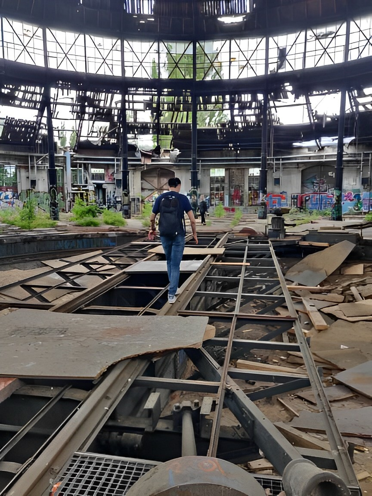

## Hiroki Fujino
Software developer, mainly developing the back end of web applications. 
Living in Berlin since 2019.

### Certificates

- [eJPT](https://certs.ine.com/542217f7-7c41-46bc-b6b8-b068ae660e74) (2024/03)
- [Blue Team Level1](https://www.credly.com/badges/47b422b5-74d7-4474-8f6d-85f983115a56/) (2024/07)
- [Certified Red Team Operator](https://eu.badgr.com/public/assertions/T341H1XDR9yPknbWFgJ3fA) (2025/08)
- [OSCP+](https://credentials.offsec.com/c6913b4c-7bc4-4152-99df-bc24c2aa9c05) (2026/04)

### CTF

- [防衛省サイバーコンテスト](https://www.mod.go.jp/j/approach/defense/cyber/c_contest/index.html) (27th / 510)
- [picoCTF 2025](https://picoctf.org/competitions/2025-spring.html) (419th / 10460)
    - [article](https://hiroki6.dev/posts/picoctf-2025)
    - [writesup](https://github.com/Hiroki6/ctf-writeups/tree/main/picoCTF-2025)
- [CryptoCTF 2025](https://cr.yp.toc.tf/) (86th / 364)
    - [writesup](https://github.com/Hiroki6/ctf-writeups/tree/main/CryptoCTF-2025)
- [Holmes CTF 2025](https://ctf.hackthebox.com/event/details/holmes-ctf-2025-2536) (383rd / 7085)
    - [writesup](https://github.com/Hiroki6/ctf-writeups/tree/main/Holmes-CTF-2025)

### Tech stack
Scala, Go, Rust, Python, AWS, GCP, Kubernetes, DDD, Microservices, CTF, Reverse engineering

### Interests
Red teaming, Malware development, Malware analysis, Zig 

[source code](https://github.com/Hiroki6/hiroki6-astro)
